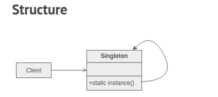

#Singleton

The Singleton pattern ensures that a class has only one instance and provides a global point of access to that instance. It is named after the singleton set, which is defined to be a set containing one element. The office of the President of the United States is a Singleton.

## Check list

1. Define a private **static** attribute in the "single instance" class.
2. Define a **public static** accessor function in the class.
3. Do "lazy initialization" (creation on first use) in the accessor function.
4. Define all constructors to be **protected** or **private**
5. Clients may only use the accessor function to manipulate the Singleton

## An Example in Java :
The Singleton class is named [Circle.java](https://github.com/jesusmtzarvizu/Design_Patterns/blob/master/Singleton/Circle.java)
 The main class is named [SingletonPattern.java](https://github.com/jesusmtzarvizu/Design_Patterns/blob/master/Singleton/SingletonPattern.java)
